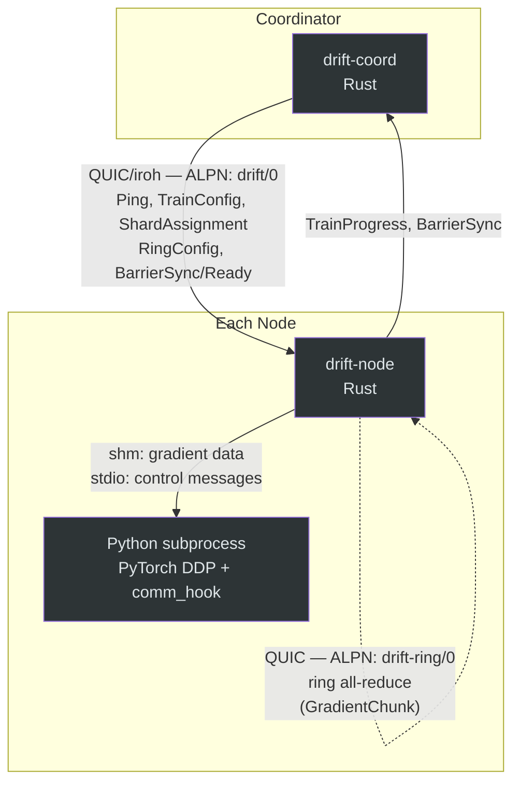
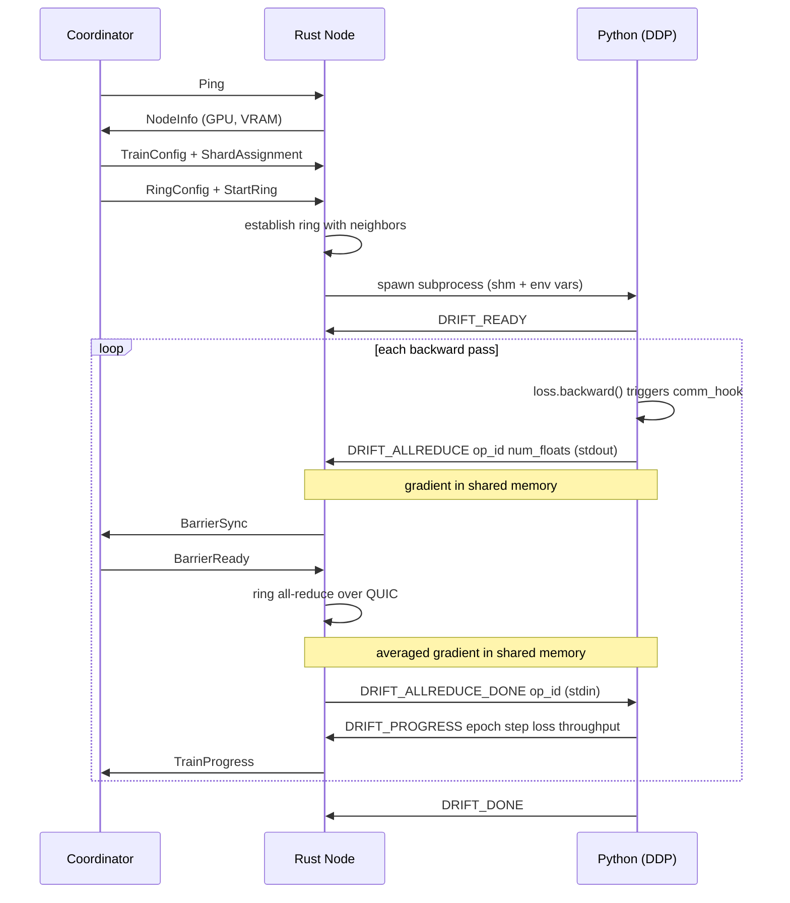

# drift

P2P distributed training. Plug your GPU into the mesh.

## What is this?

drift lets you train models across consumer GPUs on different networks. No cloud account, no VPN, no static IPs. Each machine joins the swarm by public key using [iroh](https://github.com/n0-computer/iroh) for peer-to-peer connectivity over QUIC.

Think of it as a decentralized Slurm for indie researchers.

## How it works

```
Machine A (RTX 3090)              Machine B (RTX 4090)
  $ drift-node join                 $ drift-node join
  > Node ID: abc123...              > Node ID: def456...
  > GPU: RTX 3090 (24576 MB)       > GPU: RTX 4090 (24564 MB)
  > Waiting for connections...      > Waiting for connections...

Machine A (coordinator):
  $ drift-coord train --peers abc123,def456 --epochs 10
  > Connected: abc123 | RTX 3090 (24576 MB VRAM)
  > Connected: def456 | RTX 4090 (24564 MB VRAM)
  > Starting training (2 nodes, shards weighted by VRAM)
```

## Architecture





The Rust node owns QUIC connections and ring all-reduce. When `--model-path` points to a `.py` file, the node spawns it as a subprocess with shared memory for zero-copy gradient transfer and stdin/stdout for control messages. PyTorch DDP's communication hook routes `allreduce()` calls through this IPC channel.

All traffic is encrypted end-to-end via QUIC. NAT hole-punching is handled automatically by iroh, with relay fallback.

## Project structure

```
drift/
  Cargo.toml              # Workspace
  drift-node/             # Node binary
    src/
      main.rs             # CLI: join, status
      gpu.rs              # GPU detection (nvidia-smi)
      network.rs          # iroh endpoint, connection handling
      training.rs         # Python training subprocess
  drift-coord/            # Coordinator binary
    src/
      main.rs             # CLI: train
      scheduler.rs        # Shard assignment by GPU capability
      checkpoint.rs       # Checkpoint management
      monitor.rs          # Health monitoring, progress display
  drift-cli/              # Unified CLI binary
    src/
      main.rs             # CLI: join, train, status
      node.rs             # Node logic (GPU, training, Python subprocess)
      coord.rs            # Coordinator logic (sharding, monitoring)
      shm.rs              # POSIX shared memory for Python IPC
      ipc.rs              # Control message parsing for Python subprocess
    tests/
      test_python_ipc.rs  # Cross-language Rust↔Python integration test
      helper_allreduce.py # Python helper for integration test
  drift-proto/            # Shared protocol
    src/
      lib.rs              # Message types, framing, ALPN
      allreduce.rs        # Ring all-reduce primitives
      ring.rs             # Ring state machine + async QUIC all-reduce
    tests/
      integration.rs      # Full handshake test
      training.rs         # End-to-end training pipeline
      stress.rs           # Bulk message and gradient tests
      ring_connect.rs     # Ring connectivity test (3-node)
      ring_allreduce.rs   # Ring all-reduce over QUIC + stress tests
  drift-python/            # Python package (PyTorch DDP backend)
    drift/
      __init__.py         # drift.init() — entry point, gloo + comm_hook setup
      shm.py              # Shared memory (open, read, write)
      allreduce.py        # Low-level allreduce via shm + stdio IPC
      process_group.py    # DDP communication hook
    tests/
      test_shm.py         # Shared memory unit tests
      test_ipc_roundtrip.py  # Python-side IPC round-trip test
      test_process_group.py  # DDP integration test
  examples/
    mock_train.py          # Mock training script for testing
    train_cifar.py         # Real DDP training (CIFAR-10 with drift)
    train.yaml             # Example training config
```

## Quick start

### Requirements

- Rust 1.75+
- NVIDIA GPU with drivers installed (optional, runs in CPU-only mode without)

### Build

```sh
cargo build --release
```

### Run a node

```sh
# Using the unified CLI
./target/release/drift join --name my-gpu-box

# Or the standalone binary
./target/release/drift-node join --name my-gpu-box
```

### Start training (coordinator)

```sh
./target/release/drift train \
  --peers <node_id_1>,<node_id_2> \
  --model-path model.pt \
  --dataset-path ./data \
  --epochs 10 \
  --batch-size 32
```

### Resume from checkpoint

```sh
./target/release/drift train \
  --peers <node_id_1>,<node_id_2> \
  --resume \
  --checkpoint-dir checkpoints/
```

### Check GPU status

```sh
./target/release/drift status
```

### Train with a real PyTorch script

```sh
# Install the drift Python package
cd drift-python && pip install -e . && cd ..

# Start training with a Python script
./target/release/drift train \
  --peers <node_id_1>,<node_id_2> \
  --model-path examples/train_cifar.py \
  --epochs 3 \
  --batch-size 32
```

The training script uses standard PyTorch DDP:

```python
import drift
from torch.nn.parallel import DistributedDataParallel as DDP

drift.init()                    # opens shm, inits gloo, prints DRIFT_READY
model = DDP(MyModel())
drift.register(model)           # installs drift comm_hook for gradient sync
# ... standard training loop, gradients flow through QUIC ring
```

### Debug logging

```sh
RUST_LOG=debug ./target/release/drift join
```

## Protocol

Messages are length-prefixed JSON over QUIC bidirectional streams.

### Coordinator-Node (ALPN: `drift/0`)

1. Coordinator connects to node, sends `Ping`
2. Node responds with `NodeInfo` (GPU name, VRAM, compute capability)
3. Coordinator sends `TrainConfig`, `ShardAssignment`, and `RingConfig`
4. Coordinator sends `StartRing` — nodes establish peer-to-peer ring
5. During training, nodes send `BarrierSync` per step, coordinator replies `BarrierReady`
6. Node streams `TrainProgress` updates back

### Ring All-Reduce (ALPN: `drift-ring/0`)

Nodes form a logical ring (0 -> 1 -> 2 -> ... -> N-1 -> 0). Each node connects to its right neighbor and accepts from its left. Gradient synchronization uses the standard ring all-reduce algorithm:

1. **Scatter-reduce** (N-1 iterations): each node sends one chunk to the right, receives from the left, and accumulates. After this phase, each node holds the fully-reduced version of one chunk.
2. **All-gather** (N-1 iterations): each node sends its reduced chunk around the ring so all nodes end up with the complete result.
3. **Finalize**: divide by N to get the average.

Sparse gradients (>50% zeros) are automatically compressed before sending.

## Milestones

- [x] Cargo workspace, iroh connectivity, message protocol
- [x] GPU detection, node capability announcement
- [x] Coordinator: peer management, shard scheduling
- [x] Integration test: full handshake over local QUIC
- [x] Unified CLI binary (`drift join`, `drift train`, `drift status`)
- [x] Training execution with progress streaming
- [x] Ring all-reduce primitives for gradient sync
- [x] Sparse gradient compression
- [x] Heartbeat loop and stale node detection
- [x] Checkpointing: periodic save with resume support
- [x] Fault tolerance: shard redistribution on node drops
- [x] Stress tests for bulk messages and gradient payloads
- [x] Gradient sync: ring all-reduce over QUIC streams
- [x] Python bridge: PyTorch DDP backend (shm + stdio IPC, comm_hook)
- [ ] Benchmarks vs standard DDP

## License

MIT
