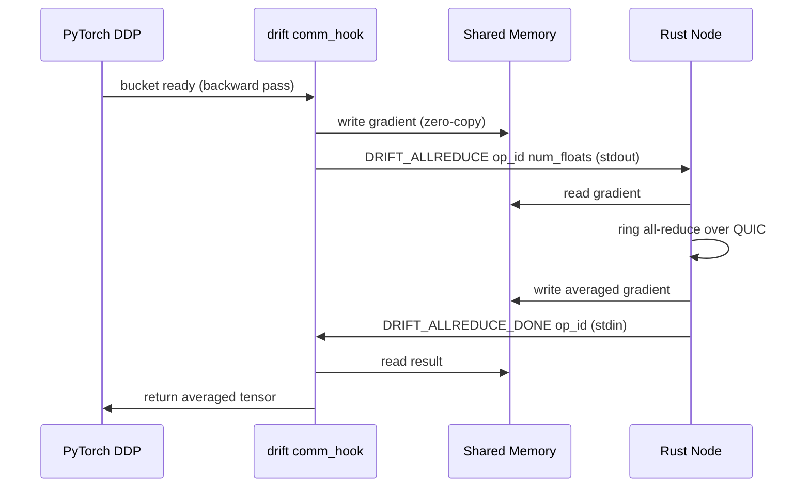

# drift-python

PyTorch DDP backend for drift P2P distributed training.

## Installation

```sh
pip install -e .
```

Optional: `pip install torch>=2.0` (required for DDP training).

## How it works

The Python package is launched as a subprocess by the Rust `drift` node. Communication between Rust and Python uses two channels:

- **Shared memory** (data plane): zero-copy f32 gradient transfer via POSIX shm
- **stdin/stdout lines** (control plane): `DRIFT_ALLREDUCE` / `DRIFT_ALLREDUCE_DONE` messages

The Rust node owns the QUIC connections and performs ring all-reduce. Python just writes gradients to shm, signals "ready", and blocks until the averaged result appears.



## Usage

```python
import drift
from torch.nn.parallel import DistributedDataParallel as DDP

# Initialize (reads DRIFT_RANK, DRIFT_WORLD_SIZE, DRIFT_SHM_NAME from env)
drift.init()

# Wrap model with DDP and register drift's communication hook
model = DDP(MyModel())
drift.register(model)

# Standard training loop — DDP.backward() routes through drift
for batch in dataloader:
    loss = model(batch).sum()
    loss.backward()   # gradients flow through shm -> QUIC ring -> shm
    optimizer.step()

# Signal completion
import sys
sys.stdout.write("DRIFT_DONE\n")
sys.stdout.flush()
```

## Environment variables

Set by the Rust node when spawning the Python subprocess:

| Variable | Description |
|----------|-------------|
| `DRIFT_SHM_NAME` | Shared memory region name |
| `DRIFT_RANK` | This node's rank (0-indexed) |
| `DRIFT_WORLD_SIZE` | Total number of nodes |
| `DRIFT_BATCH_SIZE` | Batch size per node |
| `DRIFT_LEARNING_RATE` | Learning rate |
| `DRIFT_EPOCHS` | Number of epochs |

## IPC protocol

| Direction | Message | Meaning |
|-----------|---------|---------|
| Python->Rust | `DRIFT_READY` | Shm opened, ready for training |
| Python->Rust | `DRIFT_ALLREDUCE <op_id> <num_floats>` | Gradient in shm, requesting allreduce |
| Python->Rust | `DRIFT_PROGRESS <epoch> <step> <loss> <throughput>` | Training progress |
| Python->Rust | `DRIFT_DONE` | Training complete |
| Rust->Python | `DRIFT_ALLREDUCE_DONE <op_id>` | Result written to shm |
| Rust->Python | `DRIFT_STOP` | Coordinator ended training |

## Testing

```sh
cd drift-python
PYTHONPATH=. python -m pytest tests/ -v
```
